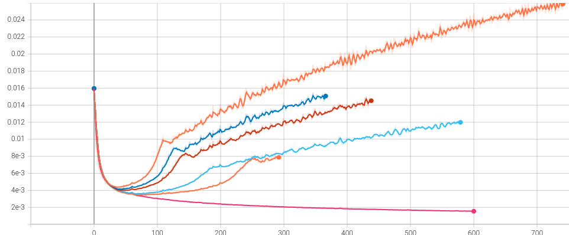
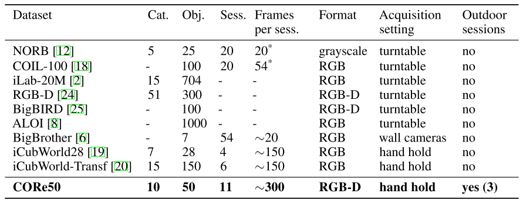

# Out of domain detection via text noise

## Quickstart

```
python3 main.py -c configs/CONFIG.yml
```


## Log

Initial idea is to use a language model and a bayesian classifier outputing normalized outputs on a, hypershere.
We then train the classifier to output the same anchor X on the same point on the sphere and a gradualy noisier input with a higher cossine similarity.
At inference time, the predictive entropy will then me a good representation of the ID/OOD nature of the sample.

```
     ┌───────────────┐
     │               │   ┌───────────────────┐
     │Language      ─┼──►│ Projector (Baye)  ├───►
────►│Model          │   │                   │   On hypershere
     │               │   └───────────────────┘   of choosen size
     └───────────────┘
```

TODO: Insert sphere figure

---

Problem seems to arise from the function mapping the noise level from text and cosine dissimilarity, resulting in failed training



From top to bottom we try different loss scalers and schedulers for the strength of the the noise.
The last loss is when we disable the noise alltogether. Note that this does not mean the model is learning, as we did not account for training collapse.

---

Language models are already capable of making distinction between datasets, further training lowers the OOD discrimination capability.

---

Sometimes the OOD detection is not evident and further training might be required. In these cases, CIDER can be tried.
The situations apparently arrise when datasets use the sort of etxt semantic (e.g tweets) while the content is different in nature.

---

Further analysis of the circumstances under which the ODD property is present are required:
- [X] Similarity measure between datasets: 
     - Measure distance for ID / OOD after training: measures ditance for data sample pairs
     - Wasserstein on VAE encoder
     - Specific modality distance: edition distance etc... 
     - Dataset/Dataset, pair/pair **Pairs number is too high to be computed in reasonable time**
     - Model output -> t-SNE/UMAP -> Euclidian/L2/Manathan: **OK**


- [ ] Retrain models from scratch on the specific datasets 
     **retrain with what objective? Word masking?**
- [X] More examples of transformers/ modalities and different architectures **OK see below**
- [X] More varieties in the number of weights **OK see below**

TODO: when multimodel use microsoft/layoutlm-base-uncased

'"distilroberta-base","roberta-base", "roberta-large","roberta-large-mnli","albert-base-v1","albert-large-v1","albert-base-v2", "albert-large-v2","t5-small","t5-base","t5-large,""facebook/bart-base","facebook/bart-large","reformer-enwik8","allenai/longformer-base-4096","distilbert-base-uncased","bert-base-uncased", "bert-large-uncased", "bert-base-multilingual-uncased", "bert-large-cased-whole-word-masking","openai-gpt","distilgpt2","gpt2","gpt2-medium","gpt2-large","xlnet-base-cased","xlnet-large-cased","xlm-mlm-en-2048","xlm-mlm-17-1280"'

---
 Imagenet réduit, Core50

Utiliser d'autres comme:

